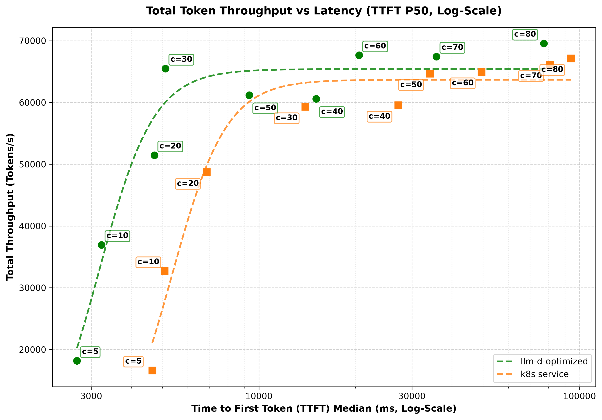
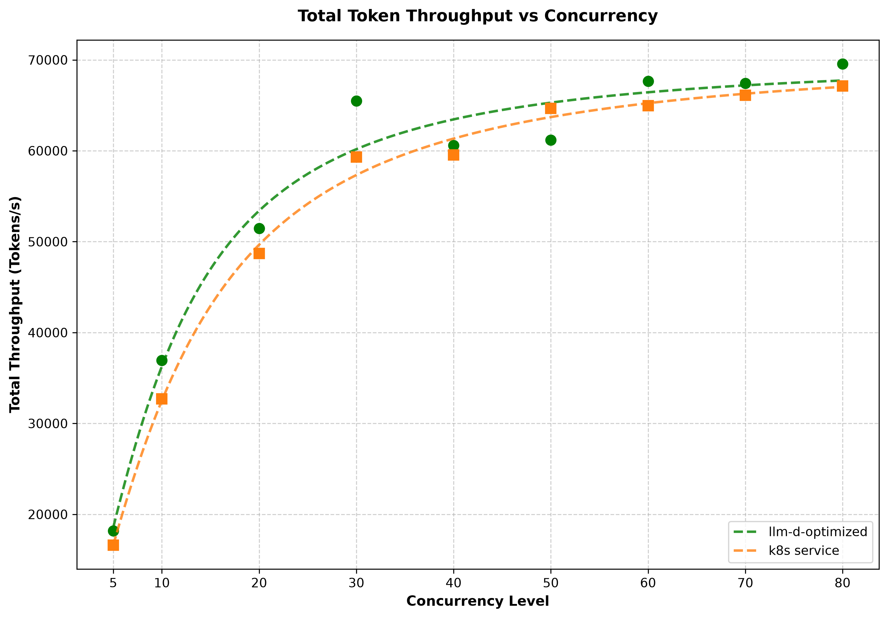
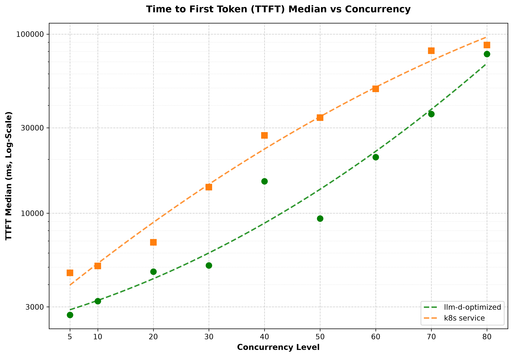

# Agentic Code Generation — NVIDIA-Nemotron-3-Ultra-550B on H200

This is one of two accelerator-specific deployments of the agentic code-generation workload; see the
[agentic-serving README](README.md#deployments) for the workload framing and the
[Qwen3-Coder-480B on TPU v7](qwen3-coder-480b-tpu.md) alternative.

## Overview

This guide deploys [RedHatAI/NVIDIA-Nemotron-3-Ultra-550B-A55B-FP8-block](https://huggingface.co/RedHatAI/NVIDIA-Nemotron-3-Ultra-550B-A55B-FP8-block)
on 8 H200 nodes, **prefill/decode disaggregated** into 6 prefill and 2 decode replicas to absorb
the large ISL:OSL ratio of multi-turn agentic sessions (heavy prefill, lighter decode). The
configuration layers the agentic optimizations onto disaggregated serving:

- **P/D disaggregation** so heavy prefill never stalls decode, stabilizing ITL.
- **Disagg-aware, prefix-cache routing** that scores both the on-device (GPU) and CPU-offload
  prefix caches when picking a prefill/decode endpoint.
- **KV cache offloading** to CPU DRAM — `200 GiB` per model server (`~1.6 TB` across the 8
  replicas) — to extend the cacheable working set far beyond HBM for long, resumable sessions.
- **FP8 block weights + FP8 KV cache** to fit the `~563 GB` of weights at `TP=8` and leave KV
  headroom; the MoE is served with Expert Parallelism.

> 🚧 This deployment uses development images (the endpoint-picker and the disaggregation routing
> sidecar) for the P/D-disaggregation scheduling plugins. Pin them to a release before relying on
> this in production.

## Default Configuration

| Parameter          | Value                                                                                                                               |
| ------------------ | ----------------------------------------------------------------------------------------------------------------------------------- |
| Model              | [RedHatAI/NVIDIA-Nemotron-3-Ultra-550B-A55B-FP8-block](https://huggingface.co/RedHatAI/NVIDIA-Nemotron-3-Ultra-550B-A55B-FP8-block) |
| Accelerator        | NVIDIA H200 (8 nodes, 8 GPUs each)                                                                                                  |
| Serving topology   | P/D disaggregated — 6 prefill replicas, 2 decode replicas                                                                           |
| TP size / EP size  | TP=8, EP enabled                                                                                                                    |
| KV cache           | FP8-quantized, with `~1.6 TB` CPU offload (`200 GiB`/replica)                                                                       |

### Supported Hardware Backends

| Backend             | Directory                                       | Notes                                            |
| ------------------- | ----------------------------------------------- | ------------------------------------------------ |
| NVIDIA GPU (vLLM)   | `modelserver/gpu/vllm/nemotron-3-ultra/`        | 8× H200, P/D disaggregated (6 prefill / 2 decode) |

## Prerequisites

- Installed proper client tools (kubectl, helm).
- Set the following environment variables:
  ```bash
  export REPO_ROOT=$(realpath $(git rev-parse --show-toplevel))
  source ${REPO_ROOT}/guides/env.sh
  export GUIDE_NAME="agentic-serving"
  export NAMESPACE=llm-d-agentic-serving
  export INFRA_PROVIDER=gke # gke (GPU only)
  ```

- Install the Gateway API Inference Extension CRDs:

  ```bash
  kubectl apply -f https://github.com/kubernetes-sigs/gateway-api-inference-extension/releases/download/${GAIE_VERSION}/v1-manifests.yaml
  ```

- Create a target namespace for the installation:

  ```bash
  kubectl create namespace ${NAMESPACE} --dry-run=client -o yaml | kubectl apply -f -
  ```

- [Create the `llm-d-hf-token` secret in your target namespace with the key `HF_TOKEN` matching a valid HuggingFace token](../../helpers/hf-token.md) to pull models.
<!-- llm-d-cicd:skip start -->
  ```bash
  export HF_TOKEN=<your HuggingFace token>
  kubectl create secret generic llm-d-hf-token \
    --from-literal="HF_TOKEN=${HF_TOKEN}" \
    --namespace "${NAMESPACE}" \
    --dry-run=client -o yaml | kubectl apply -f -
  ```
<!-- llm-d-cicd:skip end -->


## Installation Instructions

### 1. Deploy the llm-d Router

This deployment uses the disaggregation-aware router values
([`router/agentic-serving-gpu.values.yaml`](router/agentic-serving-gpu.values.yaml)), which run
separate `prefill` and `decode` scheduling profiles:

```bash
helm install ${GUIDE_NAME} \
    ${ROUTER_STANDALONE_CHART} \
    -f ${REPO_ROOT}/guides/recipes/router/base.values.yaml \
    -f ${REPO_ROOT}/guides/${GUIDE_NAME}/router/agentic-serving-gpu.values.yaml \
    -n ${NAMESPACE} --version ${ROUTER_CHART_VERSION}
```

### 2. Deploy the Model Server (GPUs)

> [!NOTE]
> The `RedHatAI/NVIDIA-Nemotron-3-Ultra-550B-A55B-FP8-block` model is ~560GB in size. Downloading a model of this scale directly from HuggingFace can take over an hour, and because every deployment triggers a new download, it creates a significant bottleneck. To save time and accelerate the deployment process, we highly recommend saving the model to a Google Cloud Storage (GCS) bucket and accessing it directly from there. For instructions on creating the GCS bucket and enabling the FUSE CSI Driver, please refer to the [page](https://docs.cloud.google.com/kubernetes-engine/docs/how-to/cloud-storage-fuse-csi-driver-setup#authentication).
> The following installation and configuration steps assume that the `RedHatAI/NVIDIA-Nemotron-3-Ultra-550B-A55B-FP8-block` model has already been stored in your GCS bucket in the folder structure `llm-models/RedHatAI/NVIDIA-Nemotron-3-Ultra-550B-A55B-FP8-block` (`llm-models` is the bucket name).
> ${INFRA\_PROVIDER} is defaulted to `gke`.

Apply the Kustomize overlay for the Nemotron-3-Ultra H200 deployment:

```bash
kubectl apply -n ${NAMESPACE} -k ${REPO_ROOT}/guides/${GUIDE_NAME}/modelserver/gpu/vllm/nemotron-3-ultra/${INFRA_PROVIDER}
```

This deploys the 6 prefill and 2 decode replicas. Wait for them to become ready (model load is
large; the startup probe allows up to an hour):

```bash
kubectl rollout status deployment/agentic-serving-gpu-vllm-prefill -n ${NAMESPACE}
kubectl rollout status deployment/agentic-serving-gpu-vllm-decode -n ${NAMESPACE}
```

## Verification

### 1. Get the IP of the Proxy

```bash
export IP=$(kubectl get service ${GUIDE_NAME}-epp -n ${NAMESPACE} -o jsonpath='{.spec.clusterIP}')
```

### 2. Send Test Requests

Open a temporary interactive shell inside the cluster:

```bash
kubectl run curl-debug --rm -it \
    --image=cfmanteiga/alpine-bash-curl-jq \
    --env="IP=$IP" \
    --env="NAMESPACE=$NAMESPACE" \
    -- /bin/bash
```

Send a completion request:

```bash
curl -X POST http://${IP}/v1/completions \
    -H 'Content-Type: application/json' \
    -d '{
        "model": "RedHatAI/NVIDIA-Nemotron-3-Ultra-550B-A55B-FP8-block",
        "prompt": "Explain how a simple agent loop works in 3 sentences."
    }' | jq
```

## Driving It with a Coding Agent

This deployment ships ready-to-use client configs for two coding agents, both pre-pointed at the
served model. First, port-forward the router's OpenAI-compatible endpoint to `localhost:8000`
(the EPP service exposes it on port `80`):

```bash
kubectl port-forward -n ${NAMESPACE} service/${GUIDE_NAME}-epp 8000:80
```

**[Claude Code](https://claude.com/product/claude-code)** — source the environment file
([`claude.env`](modelserver/gpu/vllm/nemotron-3-ultra/claude.env)) and launch:

```bash
# from the guide directory: guides/agentic-serving
source $(pwd)/modelserver/gpu/vllm/nemotron-3-ultra/claude.env && claude
```

**[opencode](https://opencode.ai/docs/)** — point `OPENCODE_CONFIG` at the provided config
([`opencode.json`](modelserver/gpu/vllm/nemotron-3-ultra/opencode.json)) and launch:

```bash
# from the guide directory: guides/agentic-serving
OPENCODE_CONFIG="$(pwd)/modelserver/gpu/vllm/nemotron-3-ultra/opencode.json" opencode
```

## Benchmarking

This guide comes with an `inference-perf` benchmark preset (defined in [agentic-serving-nemotron-3-ultra.yaml](benchmark-templates/agentic-serving-nemotron-3-ultra.yaml)) designed for agentic code-generation workloads with multi-turn interactions and tool usage. The configuration parameters include:

| Workload Characteristic | Metric / Distribution Type | Min | Max | Mean / Constant | Std Dev | Description |
| :--- | :--- | :--- | :--- | :--- | :--- | :--- |
| **Shared System Prompt** | Constant | - | - | 3,000 tokens | - | Common base instructions, libraries, and API schemas shared across all agent instances. Highly cacheable. |
| **Dynamic System Prompt** | Lognormal | 10,000 | 990,000 | 160,000 tokens | 233,600 | Repository context, file indexes, and user-specific code context. Large and variable context. |
| **Turns per Conversation** | Lognormal | 1 |3,000 | 540 turns | 48,600 | The depth of the agentic reasoning/conversational loop. Multi-turn interactivetions require sustaining long-lived sessions. |
| **Input Tokens per Turn** | Lognormal | 100 | 10,000 | 1,500 tokens | 1,200 | Ongoing prompt extensions (e.g., test logs, user follow-ups, modified code blocks) during conversation. |
| **Output Tokens per Turn** | Lognormal | 50 | 10,000 | 425 tokens | 825 | Model generations per turn, which are generally smaller than inputs but can spike when generating large files. |

### 1. Prepare the Benchmarking Suite

- Download the benchmark script:

  ```bash
  curl -L -O https://raw.githubusercontent.com/llm-d/llm-d-benchmark/main/existing_stack/run_only.sh
  chmod u+x run_only.sh
  ```

- Prepare HuggingFace token secret `llm-d-hf-token` in the namespace.

### 2. Download the Workload Template

```bash
curl -LJO "https://raw.githubusercontent.com/llm-d/llm-d/main/guides/${GUIDE_NAME}/benchmark-templates/agentic-serving-nemotron-3-ultra.yaml"
```

### 3. Execute Benchmark

The request rate and workload shape are fixed in the template, so only the endpoint needs to be
resolved before rendering:

```bash
# Benchmark parameters. CONCURRENCY_LEVEL is the number of concurrent coding sessions
# to drive; NUM_REQUESTS is fixed at 20 per session; SEED is varied per concurrency level
# so prompts don't overlap across runs (matches the published results below).
export CONCURRENCY_LEVEL=40
export NUM_REQUESTS=$((20 * CONCURRENCY_LEVEL))
export SEED=$((7 + CONCURRENCY_LEVEL))

export IP=$(kubectl get service ${GUIDE_NAME}-epp -n ${NAMESPACE} -o jsonpath='{.spec.clusterIP}')
envsubst < agentic-serving-nemotron-3-ultra.yaml > config.yaml
./run_only.sh -c config.yaml -o ./results
```

## Benchmark Results

The results below are with 8 replicas of H200 GPU on the benchmark workload described above. Scaling concurrency up to 80 sessions.

### Summary with 60 concurrent coding sessions:

| Metric                  | k8s Service | llm-d-optimized  | Δ Improvement | 
| :---                    | :---        | :---             | :---          | 
| **TTFT P50 (ms)**       | 49462       | 20543            | ⬇️  58%        | 
| **Total tokens / sec**  | 64958       | 67645            | ⬆️  4%         | 
| **Input tokens / sec**  | 64474       | 66716            | ⬆️  3%         | 
| **Output tokens / sec** |   484       |   929            | ⬆️  92%        | 

### Latency Profiles:

<p float="left">
  
  
  
</p>

## Cleanup

To clean up resources:

```bash
helm uninstall ${GUIDE_NAME} -n ${NAMESPACE}
kubectl delete -n ${NAMESPACE} -k ${REPO_ROOT}/guides/${GUIDE_NAME}/modelserver/gpu/vllm/nemotron-3-ultra/
kubectl delete namespace ${NAMESPACE}
```
